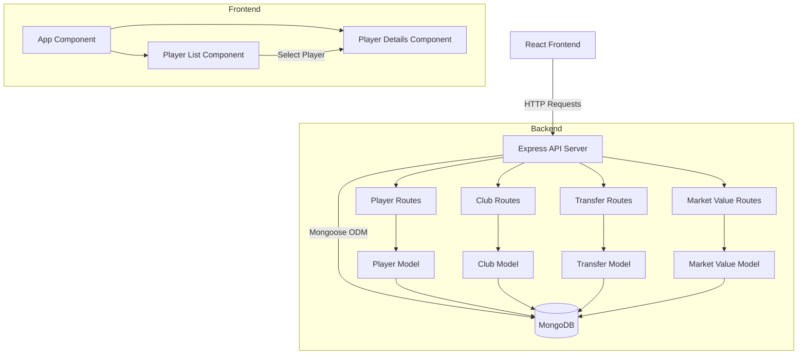

# Football Transfer Market Application

A web application for tracking football players, clubs, transfers, and market values - inspired by the popular Transfermarkt platform.

## Overview

This application provides a comprehensive database of football players and their careers, including:

- Player profiles with personal and professional details
- Club information and rosters
- Transfer history between clubs
- Market value tracking over time

## Architecture

## Features

- Browse and search for players
- Filter players by position
- Sort player list by various attributes
- View detailed player information
- See player's club history
- Track market value changes

## Technology Stack

- **Frontend**: React + Vite, CSS
- **Backend**: Node.js, Express
- **Database**: MongoDB with Mongoose ODM

## Getting Started

See the [SPECS.md](./SPECS.md) file for technical specifications and setup instructions.
