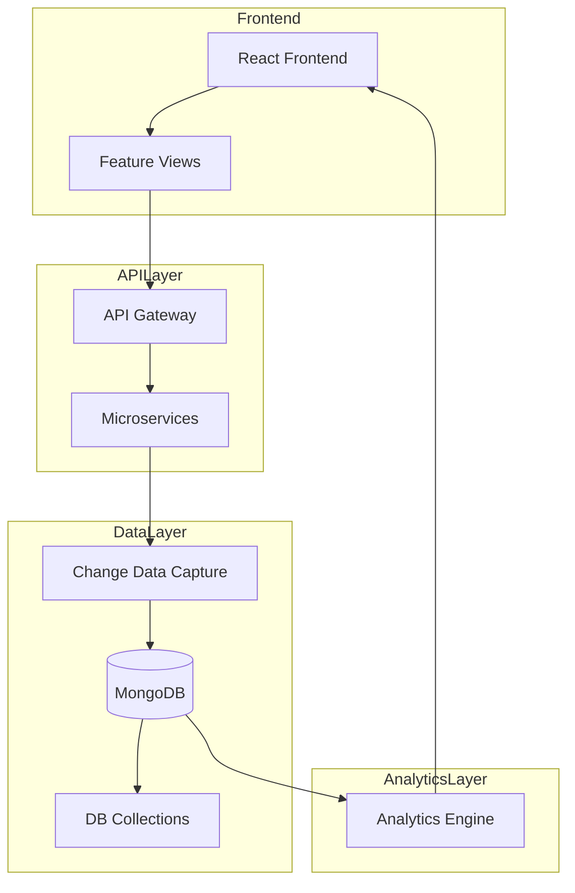

# Football Transfer Management System - Architecture Diagram

## System Architecture Overview

The following Mermaid diagram illustrates the complete architecture of the Football Transfer Management System, showing all major components, their relationships, and data flow patterns.

## Architecture Components Description

### 1. Frontend Layer
- **React Frontend**: Main user interface built with React.js
- **Material UI Components**: UI component library for consistent design
- **Feature Views**: Dedicated views for players, transfers, clubs, agents, contracts, and analytics

### 2. API Layer
- **API Gateway**: Central entry point for all client requests
- **Microservices**:
  - Player Service: Manages player profiles, stats, and market values
  - Transfer Service: Handles transfer records and fee tracking
  - Club Service: Manages club profiles and squad information
  - Agent Service: Handles agent profiles and client relationships
  - Contract Service: Manages contract details and history
  - Analytics Service: Provides data analysis capabilities

### 3. Data Consistency Layer
- **Change Data Capture (CDC)**: Tracks changes to data for consistency
- **Event Bus**: Distributes change events across services
- **Conflict Resolution**: Uses timestamps to resolve data conflicts

### 4. Database Layer
- **MongoDB**: Primary NoSQL database
- **Collections**:
  - Players: Player profiles and statistics
  - Transfers: Transfer records and details
  - Clubs: Club information and budgets
  - Agents: Agent profiles and client lists
  - Contracts: Contract details and clauses

### 5. Analytics Module
- **Market Value Analysis**: Analyzes player value trends
- **Transfer Patterns**: Identifies patterns in transfer activities
- **Value Prediction**: Predicts future market values
- **Historical Trends**: Tracks long-term market trends

## Data Flow

1. Users interact with the React Frontend to view or modify data
2. Frontend requests are sent to the API Gateway
3. API Gateway routes requests to appropriate microservices
4. Microservices process requests and trigger Change Data Capture for modifications
5. CDC ensures data consistency across the system via the Event Bus
6. Data is stored in MongoDB collections
7. Analytics Service processes data from MongoDB for trend analysis
8. Analyzed data is presented in the Analytics Dashboard

## Implementation Technologies

- **Frontend**: React.js, Material-UI
- **Backend**: Node.js, Express.js
- **Database**: MongoDB with Mongoose ODM
- **Development Tools**: VS Code, Git, Postman

This architecture follows a microservices-based approach with RESTful API endpoints, providing scalability, maintainability, and flexibility for the football transfer management system.

